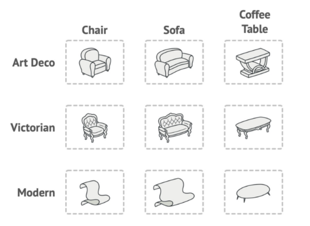
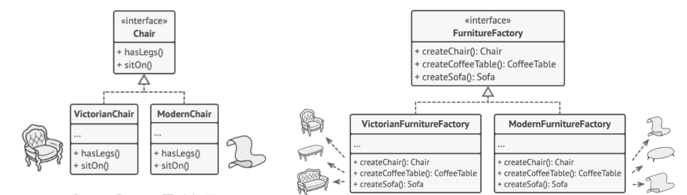
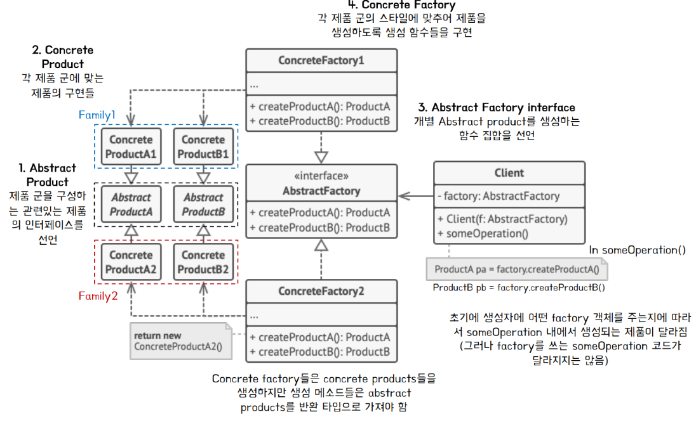
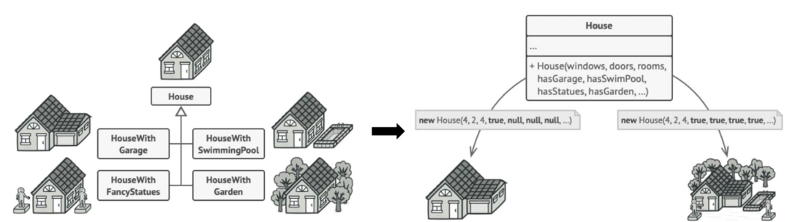
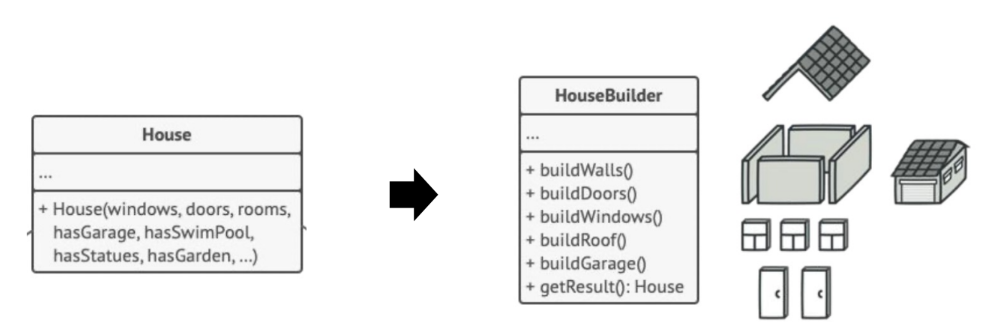
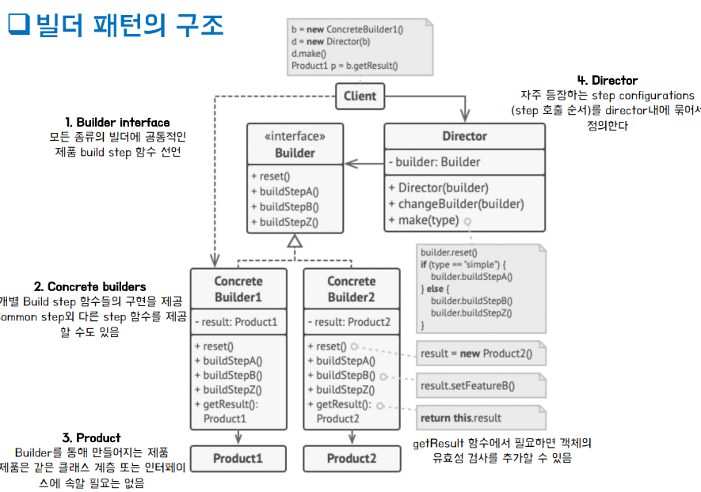
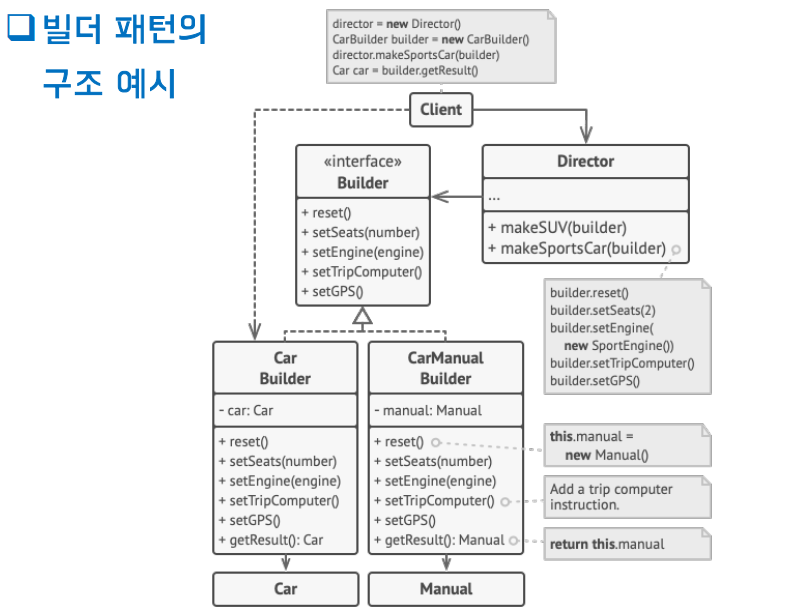
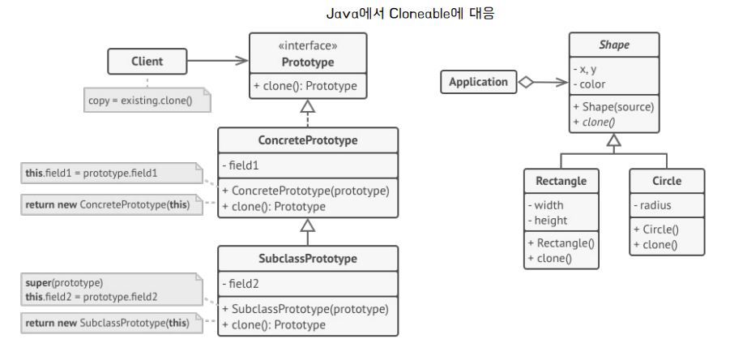
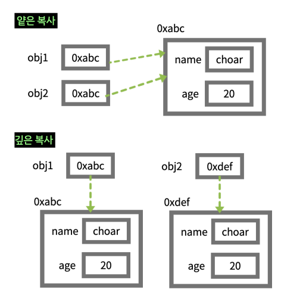

## [Singleton Pattern](Singleton.md)

## [Factory Pattern](FactoryMethod/FactoryMethod.md)

## Enum Factory Pattern 

### Factory Method Pattern의 문제점 
- 제품의 객체의 수마다 ***팩토리 서브 클래스를 모두 구현***해줘야한다.
- 팩토리 클래스는 한 번만 인스턴스화 하고 재사용하는 것이 필요 
  - 제품의 객체 생성하는 역할만 하기 때문
  - 여러 팩토리 객체를 생성 시 객체의 낭비 발생 

- 해결책 : Enum Factory Method 
  - 일일이 서브 팩토리 클래스를 구현할 필요가 없이, 하나의 enum Factory에서 객체 생성 가능

### Enum을 활용한 해결 아이디어 
- Enum을 이용한 싱글톤 객체를 통해 단일한 팩토리 클래스를 생성 
- Enum을 이용하면 멀티톤(multiton)으로도 일반화가 가능하다. 
  - Enum Class안에서 여러 개의 인스턴스를 관리할 수 있다. 
  - 새로운 제품(product)를 추가할 때는 Product class를 추가해주고 Enum Factory에 Factory 객체를 추가해주면 된다.
- 하나의 Factory 객체는 싱글톤으로 공유된다. 
- 외부에서 객체를 만들어 줄 필요가 없다. 
- 단점 
  - 새로운 Factory 추가 시 기존의 Enum 코드가 수정됨
    - OCP를 엄밀히 지킬 것인가 vs 코드 구조의 복잡성
  - Enum의 상속 기능 부재 
    - 만일 Factory가 복잡한 상속 계층으로 구성 시, 상속 구조 표현에 한계가 있다. 

## Abstract Factory Pattern
### 추상 팩토리 패턴이란? 
- 연관 있는 여러 객체(제품) 군(family)의 생성을 추상화한 생성 패턴 
- vs 팩토리 메서드 
  - 팩토리 메서드 : 단일 객체(제품)의 생성을 추상황 
  - 추상 팩토리 메서드 : 관련이 있는 여러 객체(제품)들의 일관된 생성을 추상화
- 연관 있는 제품군의 예시

- {Chair, Sofa, CoffeeTable}에 대해 _**스타일 별로**_ 각 제품을 일관되게 생성할 필요가 있음 

### 구현

- 새로운 스타일의 제품 군이 추가되더라도 기존의 코드를 바꾸지 않고 추가가능해야한다. 
- 제품 별로 인터페이스로 추상화 
  - Chair, sofa, CoffeeTable  
- ***모든 추상 제품***에 대한 생성 메소드를 가지는 팩토리로 추상화 
  - FurnitureFactory 
- 팩토리 인터페이스를 구현한 각 서브 팩토리에서는 일관된 스타일의 제품군이 생성될 수 있도록 생성 메소드를 구현 
  - VictorianFurnitureFactory, ModernFurnitureFactory 

 ### 구조

### 장점 
- 클라이언트 코드와의 결합도 감소. 
  - 객체를 생성하는 코드를 분리
- 제품 군(family)을 쉽게 대체할 수 있다. 
- SRP, OCP를 준수 

### 단점 
- 코드 구조의 복잡성 증가 
  - 제품, 팩토리들의 구체 클래스를 모두 구현해줘야한다. 
- 새로운 제품 추가 시 모든 팩토리 구현 로직에 새로운 생성 함수 추가되어야한다. 
  - 새로운 Furniture 추가시 , createFurniture를 FurnitureFactory와 이를 구현한 구체 팩토리 클래스에 추가해야한다. 

## Builder Pattern
### Builder Pattern이란? 
- 복잡한 객체 생성 과정과 표현 방법을 분리하여 클라이언트가 ***다양한 구성을 조합***하여 객체를 생성할 수 있도록 하는 생성 패턴    
- 만약, 객체를 생성하고 초기화하려고 할 때, 해당 클래스의 멤버 변수가 많은 경우에 모든 멤버 변수를 생성자에 넣어야할 필요가 있을까? 
- 특정 객체 생성 시 모든 멤버 변수의 값이 쓰이지 않는다면?

- 생성자(House)에 전달되어야할 매개변수의 개수가 많다. 
- 특정 House 객체의 종류에 따라 필요한 변수가 각각 다 다르다. 
  - 다수의 null 값을 생성자에 넣어야한다. 
### 구현 
- 클래스 내에서 객체 생성에 관련된 코드를 빼내서 Builder라는 별도의 클래스로 분리 
  - 객체의 변수 값을 설정할 수 있게 함 

  - HouseBuilder 클래스가 Builder로써, House라는 객체를 생성한다. 
  - 각각의 객체마다 필요한 변수만 HouserBuilder의 메서드에 인자로 전달하면 된다. 
### 구조 

- Builder interface 
  - 모든 종류의 빌더에 공통적으로 제품을 build하는 함수들(build steps) 선언 
- Concrete Builders 
  - Builder interface를 구현 
  - Builder interface에서의 공통적인 build함수 제외 다른 step의 build 함수 구현 

- Product 
  - Concrete Builder 클래스 내에 객체로 존재
  - ConcreteBuilder의 함수(build step)들을 통해 해당 객체의 변수들의 build됨 

- Director 
  - 자주 등장하는 build 함수 조합, 순서를 (step configuration) 함수 내에 묶어서 구현 

- 예시 

### 장점 
- 구성 하기 복잡한 객체를 순차적으로 만들 수 있음 
- 복잡한 객체를 만드는 구체적인 과정을 숨길 수 있다. 
- 동일한 프로세스를 통해 ***구성에 따라 다른 객체***를 만들 수 있음 

### 단점 
- 선행적으로 Builder 객체를 먼저 만들어야 원하는 객체 생성 가능 
- 객체 생성을 위한 코드 대비 구조적으로 복잡해짐 
  - 간단한 객체는 생성자를 통해서 만드는 게 좋을 수도 있다. 

## Prototype Pattern 
### 프로토 타입패턴이란? 
- 기존 객체를 복제 (clone)하여 새로운 객체를 만드는 생성 패턴 
  - 클래스에 의존하지 않으면서 기존 객체를 복사 
  - 원형이 되는(prototypical) 인스턴스를 사용하여 생성할 객체의 종류를 명시 
  - 만들어진 견본을 복사해서 새로운 객체 생성 
  
- 객체의 생성/복사가 까다로울 수 있는 상황 
  - private/protected 멤버 변수 때문에 클래스 외부에서 객체를 복사하지 못할 수 있다. 
  - 객체 생성에 따른 리소스가 많이 요구 될 때 새로 생성하는 것은 비효율적이다. 

### 구조

- 복제되는 실제 객체에 복제 프로세스를 위임한다. 
- clone이라는 공통의 인터페이스를 가지게 한다. 

### 구현 예시 
- Java Cloneable Interface
  - Cloneable interface를 구현
  - clone()를 오버라이딩 

### 얕은 복사 vs 깊은 복사 

#### 얕은 복사 
- 완전한 복사가 이루어지지 않음
- 같은 주소의 객체를 참조함 
- 원본 객체가 값 변경시, 복사된 객체도 같은 주소의 객체를 참조하기 있기 때문에 값이 변경됨 

#### 깊은 복사 
- 완전한 복사가 이루어짐 
- 복사된 객체가 별도의 주소 공간의 별도로 생성된 객체를 가리킨다. 
- 원본 객체가 값 변경하더라도, 복사 객체의 값은 독립적인 주소 공간에 위치해 있기 때문에 수정되지 않는다. 