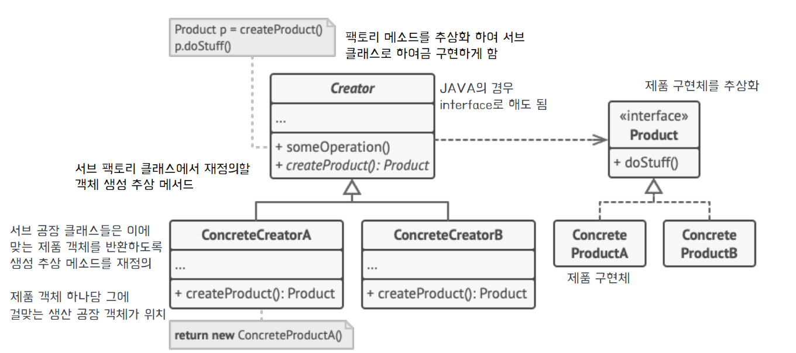
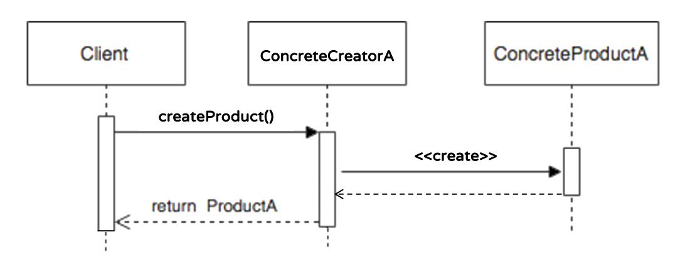
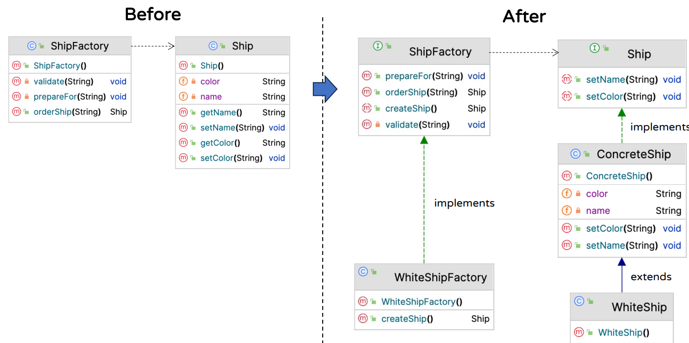

## Factory Method Pattern 
### 팩토리 메서드 패턴이란?
- 객체 생성을 서브 클래스에 위임할 수 있는 생성 패턴
- ***객체를 생성하기 위한 인터페이스***를 정의
- 어떤 클래스를 인스턴스화 할지는 **_팩토리 인터페이스를 구현한 서브 클래스가 결정_**

### 사용되는 상황
- 객체의 생성을 _**코드의 나머지 부분으로부터 분리**_ 하려고 할 때
- 사용자가 자체 객체를 만들어 시스템을 확장하는 방법을 제공하고자 할 대
- 객체 생성에 있어서 기존의 코드를 건들지 않고, 쉽게 확장할 수 있는 방법
    - OCP 원칙

### 구조

- 인터페이스를 통해 팩토리 객체와 제품 간 결합을 느슨하게 한다.
    - 팩토리 클래스는 제품 객체를 도맡아 생성
    - 팩토리 클래스의 서브 클래스 메서드에서 여러가지 제품 객체 생성을 책임진다.
### 시퀀스

- ConcreteProductA에 대한 구체적인 생성은 ConcreteCreatorA 팩토리 클래스가 전담한다.
- Client는 ConcreteCreatorA를 통해 Product 객체를 받는다.

### ShipFactory 예제 설명

- Ship
    - Interface로 선언하여 공통 속성인 color와 name을 선언

- ConcreteShip
    - Ship Interface을 구현
    - color와 name의 setter을 구현
- WhiteShip
    - ConcreteShip을 상속하여 구현
    - 객체 생성시 name("WhiteShip"), Color("White") 값 할당   
#### 팩토리
- ShipFactory
    - Interface로 선언
    - 해당 인터페이스를 구현한 구체 클래스가 특정 Ship(WhiteShip)의 생성을 담당한다.

- WhiteShipFactory
    - ShipFactory 인터페이스를 구현하여, WhiteShip의 생성을 담당한다.

## 장점
- ***객체의 생성을 캡슐화***
    - 객체의 생성을 나머지 코드와 분리 시키기 때문에 코드의 유지보수를 용이하게 한다.
- ***인터페이스 기반의 재사용***
    - 객체의 생성이 인터페이스를 통해 이루어진다.
- _**단일 책임 원칙(SRP) 준수**_
    - 팩토리 클래스에서는 객체의 생성 및 초기화라는 기능만 담당하고 있다.
- _**개방-폐쇄 원칙(OCP) 준수**_
    - 기존 코드의 변경 없이 새로운 코드를 유연하게 추가 가능
    - 객체를 생성하기 위한 인터페이스를 정의하지만 어떤 클래스를 인스턴스화 할지는 서브 클래스가 담당한다.

## 단점 
- _**코드의 구조 복잡도 증가**_
  - 각 제품 구현체마다 팩토리 객체를 모두 구현해줘야한다. 
  - 클래스의 수가 많아지며, 구조 파악이 어려워짐 

- _**객체 생성에 따른 오버헤드 증가**_ 
  - 추가적인 클래스 객체가 생성되어 성능에 영향을 미침 
