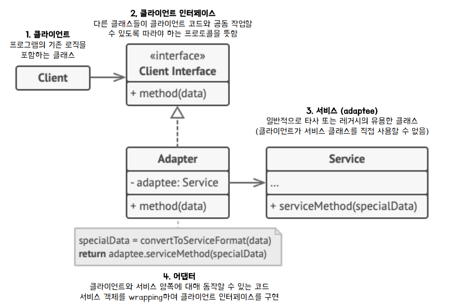
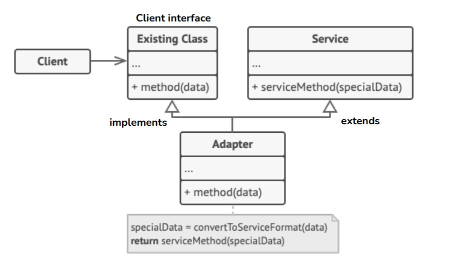
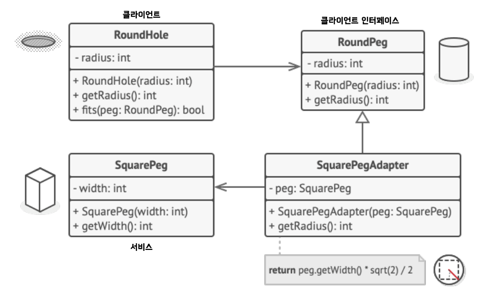
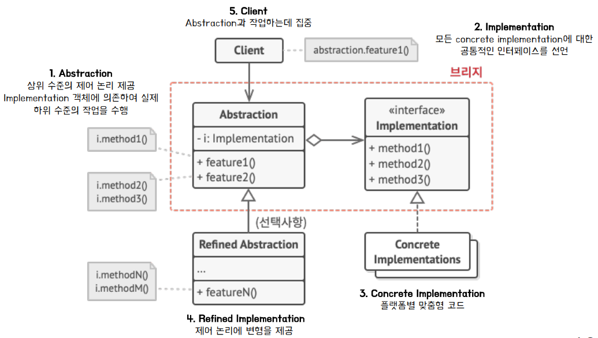
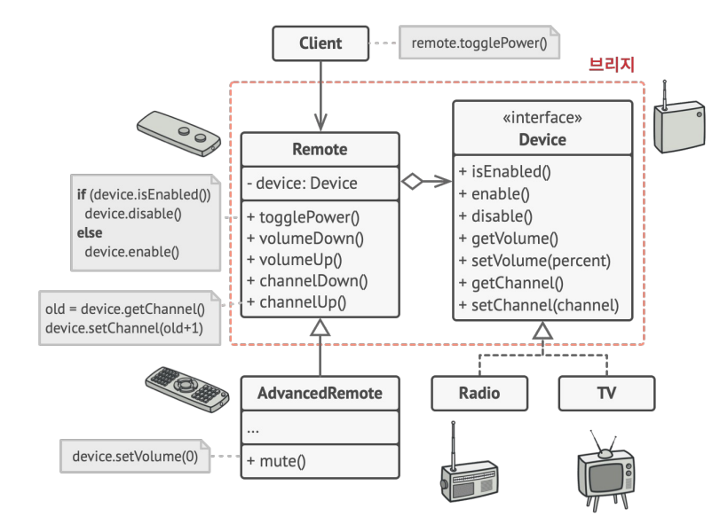

## Adapter Pattern
### 어댑터 패턴이란? 
- 호완성이 없는 인터페이스 때문에 함께 동작할 수 없는 클래스들을 어댑터를 통해 함께 작동할 수 있도록 변환 
  - 이미 구축 되어있는 것을 새로운 어떤 것에 사용하려고 할 때, 양 쪽간의 호환성 유지해주기 위해 
### 객체 어댑터 구조 

- Client interface 
  - 다른 클래스들이 클라이언트 코드와 공동 작업 시, 해당 프로토콜을 따라야함
  - Client interface 통해서 메소드가 호출되어야함 

- Service 
  - 일반적으로 타사 또는 레거시의 유용한 클래스 
  - Client에서 직접 호출이 불가능하다. 
  - 이를 호출하기 위해 아래의 Adapter을 이용 
- Adapter
  - 클라이언트와 서비스 양쪽에 대해 동작할 수 있는 코드 
  - Service를 주입 받아 Client 대신 호출 
    - Adapter는 Client를 구현한다. 
      - Client의 메소드를 오버라이딩 한다. 
      - 주입 받은 Service의 메소드를 호출하여 작업을 위임한다.
      - Client의 규약을 따르되, Client에서 직접 Service를 호출하지 않고, Adapter를 통해서 호출하게 된다. 
### 클래스 어댑터 구조 

- 객체 어댑터 구조에서 Service를 주입 받아 수행한 것과 달리, _**Adapter에서 Service를 상속하여**_, Adapter에서 Service 호출 
- 다중 상속을 지원하는 C++같은 언어에서 활용 가능하다. 
  - 자바 소스코드에서는 다중 상속이 불가능하므로 다음과 같이 구현한다. 
    - Client interface는 구현 (implements)
    - Service Class는 상속 (extends)
### 사용 시기
- 새로운 인터페이스가 레거시와 호환이 되지 않을 때 
- 이미 만든 것을 재사용하고자 하나, 수정은 하고 싶지 않을 때 
- 소프트웨어 구 버전과 신 버전을 공존 시키고 싶을 때 
### 예시 

### 장점 
- SRP 준수 
  - 프로그램의 기본 비즈니스 로직에서 ***인터페이스를 분리***할 수 있다. 
- OCP 준수 
  - 기존 클래스 코드를 건들지 않고, _**클라이언트 인터페이스를 통해**_ 어댑터와 작동
- 추가로 필요한 메소드가 있으면 어댑터로 빠르게 구현 가능 
  - 버그가 발생해도 기존의 클래스에는 버그가 없으므로 어댑터만 중점적으로 조사 

### 단점 
- _**새로운 인터페이스와 어댑터를 함께**_ 도입해야 해서 복잡성이 증가  
- 때로는 서비스 (adaptee) 클래스를 변경하는 것이 간단할 수도 있음 
## Bridge Pattern 
### 브릿지 패턴이란? 
- 큰 클래스 또는 밀접하게 관련된 클래스들의 집합을 두 개의 개별 계층구조로 나눈 후 각각 독립적으로 개발 할 수 있도록 하는 구조 패턴

#### 도입 배경 
- 모양과 색상 두 가지의 독립적인 차원에서 클래스를 상속 구조로 확장하려고 하기 때문에 계층 구조가 증가함 
  - Shpae과 Color의 조합을 가지는 클래스 구성에서는 새로운 모양과 색상 유형이 추가될 때마다 계층 구조는 기하급수적으로 늘어남 

#### 적용 
- 상속 => 포함 관계로의 전환 
  - 차원 중 하나를 별도의 클래스 계층 구조로 _**추출하고 포함 될 수 있도록**_ 구조를 변경 
  - Shape(모양) 클래스는 색상 객체를 가리키는 reference 필드를 가진다. 
    - 브릿지 : 연결된 색상 객체에 모든 색상 관련 작업 위임 가능 

### 역할 구분 
- Abstraction과 Implementation을 ***분리하고 브릿지로 연결***하여 변화 대응에 독립적으로 확장 가능하다. 
#### Abstraction 
- 일부 개체에 대한 상위 수준의 제어/기능 레이어 
  - 자체적으로 실제 작업을 수행하는 것이 아님 
  - 구현 레이어에 위임해야한다. 

#### Implementation
- 각 기능에 대한 구현부를 담당하는 레이어 

### 구조 

#### 예시 구조  

- Remote
  - Abstraction 
  - 상위 수준의 제어 논리 제공 
  - Implementation 객체(Device를 구현한 클래스)에 의존하여 실제 하위 수준의 작업 수행
- Device 
  - Implementation 
  - 모든 Concrete Implementation에 대한 공통적인 인터페이스 선언 
  - Remote에 주입됨 
  - Device를 구현한 구체 클래스를 참조하여, 메소드 호출 

- Radio, TV 
  - Implementation  
  - Implementation의 규약을 정의한 Device interface를 플랫폼별로 다양하게 구현 
  - Remote에서 해당 클래스의 메소드를 호출하여 실제 작업을 수행한다. 

### 브릿지 vs 어댑터 
- 브릿지 
  - 사전에 설계 되어서 ***다양한 부분을 독립적***으로 개발 
- 어댑터 
  - 기존 앱과 사용되어 원래 _**호환되지 않던 일부 클래스들이**_ 서로 잘 동작하도록 함 

### 장점 
#### OCP 준수 
  - 새로운 추상화들과 구현들을 상호 독립적으로 구분 가능하다. 
    - Abstraction vs Implementation 

#### SRP 준수 
  - Abstraction, Implementation 각각 단일한 책임만을 가진다. 
    - Abstraction  
      - 상위 수준 논리의 구현
    - Implementation 
      - 구현 플랫폼 세부 정보
### composite pattern

### Decorator Pattern 

### Facade Pattern 

### Flyweight Pattern 

### Proxy Pattern 