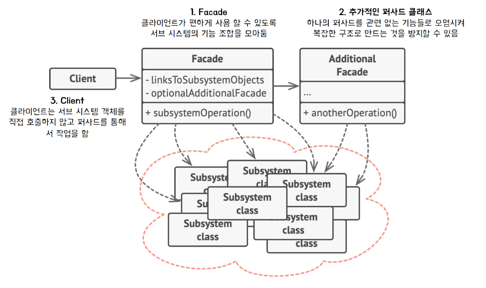
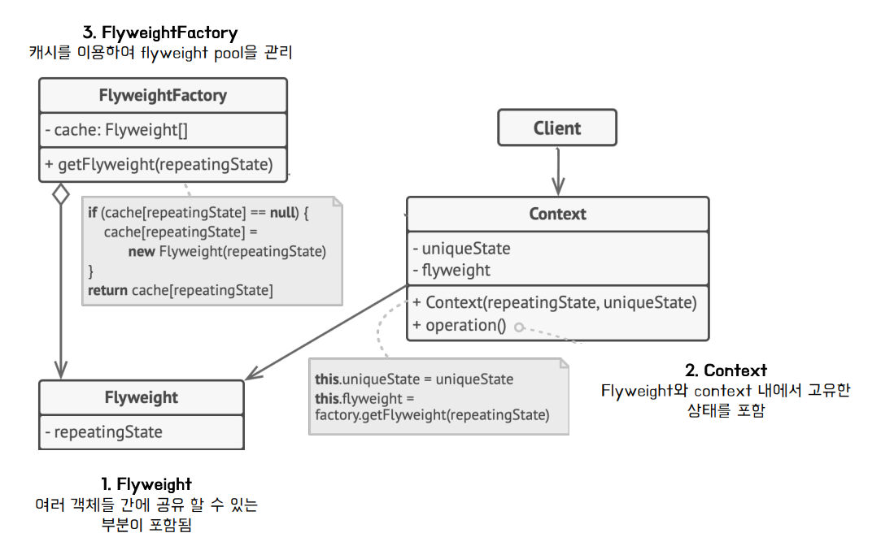
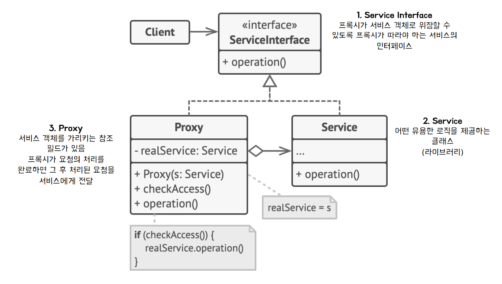

## Facade Pattern
### 퍼사드 패턴이란? 
- 라이브러리 (또는 서브시스템)에 대해 사용하기 편한 인터페이스를 구성하기 위한 구조 패턴 
  - 라이브러리의 각 클래스와 메서드의 사용이 복잡, 바로 가져다 쓰기 어려울 때 
  - 구현 디테일은 내부로 묶고 사용자가 쓰기 쉽게 정리하는 것 
### 필요한 상황 
- 라이브러리의 여러 API를 조합해서 쓰는 상황에서 클라이언트의 코드의 라이브러리의 의존성이 심할 때 
- 복잡한 서브 시스템에 대한 제한적이지만 간단한 인터페이스가 필요할 때 

### 구조 

### 장점  
- 서브 시스템 간의 의존 관계가 많을 경우 이를 감소시키고 의존성을 한 곳으로 모음 
- 클라이언트가 외부의 퍼사드 클래스만 다루기 때문에 기능을 쉽게 이해하고 사용할 수 있음 

### 단점 
- 앱의 모든 클래스에 결합된 god object가 될 수 있다. 
- 코드가 추가되어서 유지보수 측면에서 관리 대상이 늘어남 

## Flyweight Pattern
### 플라이 웨이트 패턴이란? 
- 메모리 사용량을 최소화하기 위해 _**재사용 가능한 객체를 공유할 수 있게**_ 해주는 구조 패턴 
  - _**캐시 (Cache)**_ 개념을 도입하여 패턴화 
  - 자주 변화하는 속성 (extrinsic)과 변하지 않는 속성(intrinsic)으로 분리 
  - 변하지 않는 속성은 캐시함 (따로 저장하고 재사용해 메모리를 아낌)

### 구조 

### 사용 시기 
- _**메모리에 오래 상주하는 객체**_(Flyweight중 Cache)가 많이 생성되어 메모리 사용이 높을 때 
- ***공통적인 인스턴스(Flyweight)***를 많이 생성하는 로직이 포함되는 경우 

### 장점 
- 메모리 사용량과 프로그램 속도 개선 가능 
  - new 연산자 사용하여 객체 생성시 데이터 생성 및 메모리 적재에 시간이 소모 됨 
### 단점 
- 캐싱등을 처리하기 위한 클래스 도입(Flyweight Factory)으로 코드의 복잡성이 올라감 

## Proxy Pattern 
### 프록시 패턴이란? 
- 대상 원본 객체에 대한 접근을 제어하거나 대리할 수 있도록 해주는 구조 패턴 
  - 클라이언트가 대상 원본 객체를 직접 쓰는 것이 아니라 대리인을 거쳐 쓰는 개념 
  - 원본 객체의 수정이 불가능 할 때, 원래 객체와 같은 인터 페이스를 가지는 proxy를 두어 처리 
    - 대상 클래스가 민감한 정보를 가지고 있어 권한에 따라 접근을 제한 하고 싶을 때 
    - 인스턴스화 하기 무거워 Lazy 초기화를 하고 싶을 때 
### 구조

### 효과 
- 보안 
  - 클라이언트 작업 권한에 따라 유효한 권한일 경우에만 전달 
- 캐싱 
  - 데이텅가 캐시에 아직 존재하지 않는 경우에만 작업이 실행 되도록 할 수 있음 
- 데이터 유효성 검사 
  - 입력을 원본 객체로 전달하기 전에 유효성을 미리 체크 가능 
- 지연 초기화 
  - 원본 객체의 생성 비용이 비싼 경우 프록시가 필요할 때 생성하게 할 수 있음 
- 로깅 
  - 메소드 호출과 상대 매개 변수에 대해 중간에 기록을 남길 수 있음 
  

### 장점 
- 원래 하는 기능을 유지하며 부가 기능을 원래 사용법과 같이 쓸 수 있음 
- OCP 준수 
  - 기존 대상 객체 코드의 변경 없이 기능 확장 

- SRP 
  - 원본 객체 : 주요 기능 
  - 프록시 : 부가 기능 

### 단점 
- 많은 프록시 클래스를 도입해야하므로 코드의 복잡성 증가 
- 프록시 클래스 자체에 들어가는 자원이 많아진다면 처리 비용 증가 