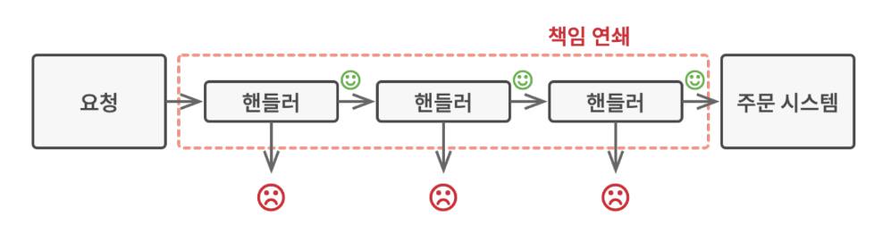
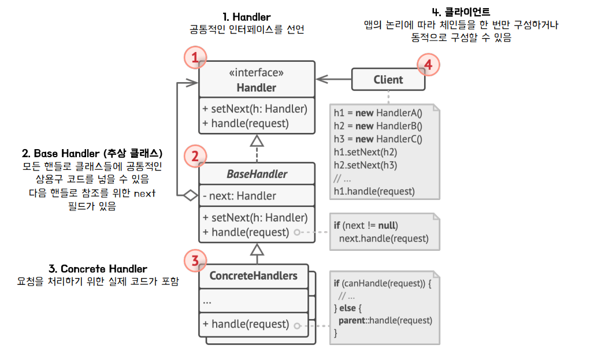
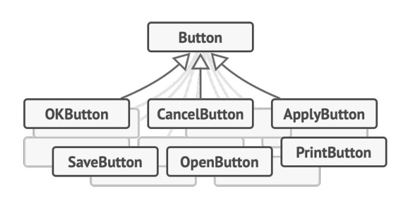
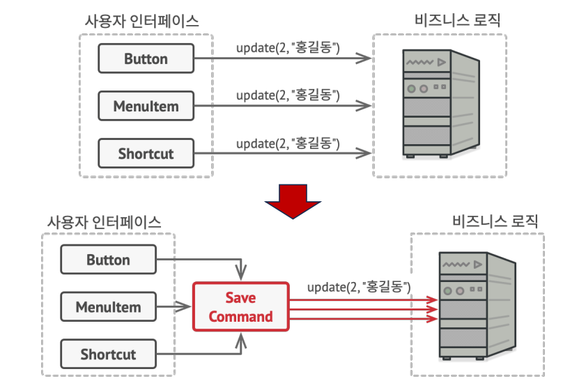
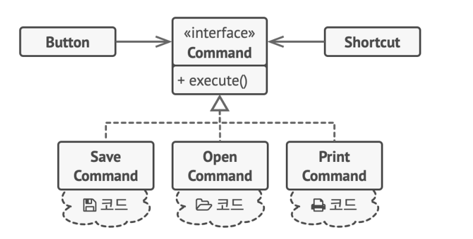
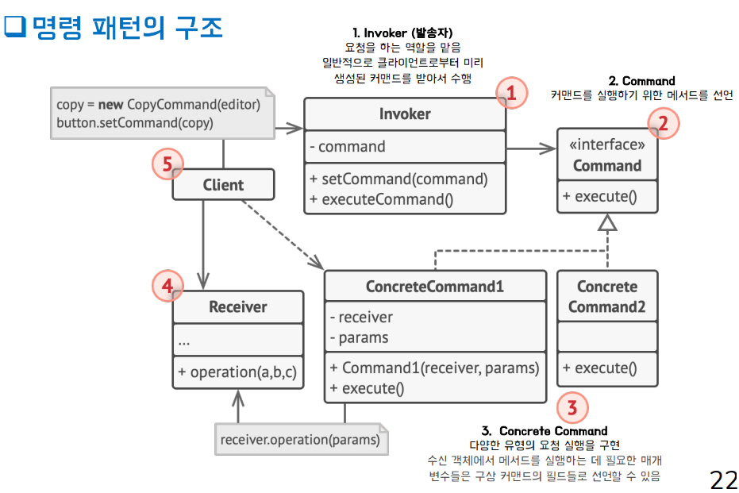
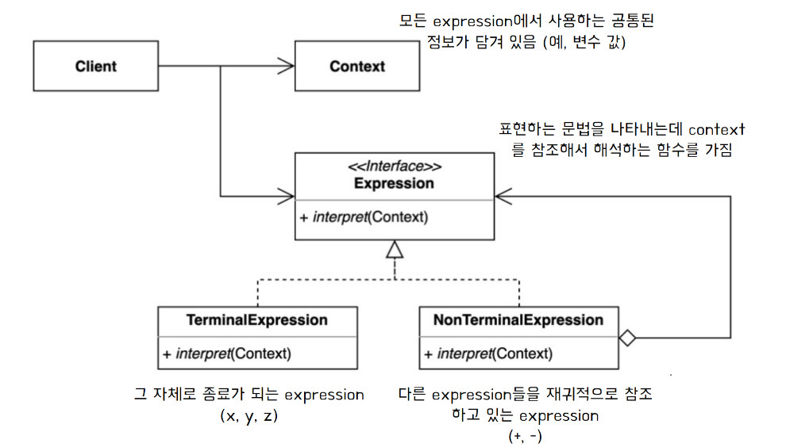
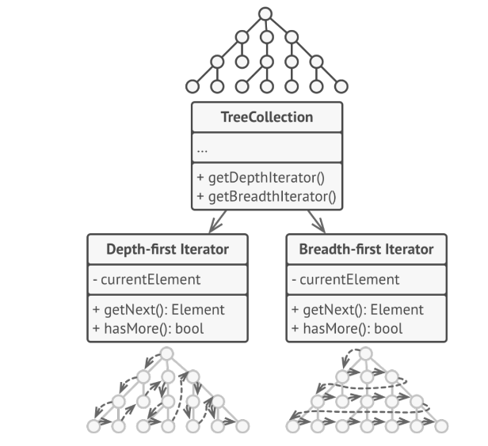
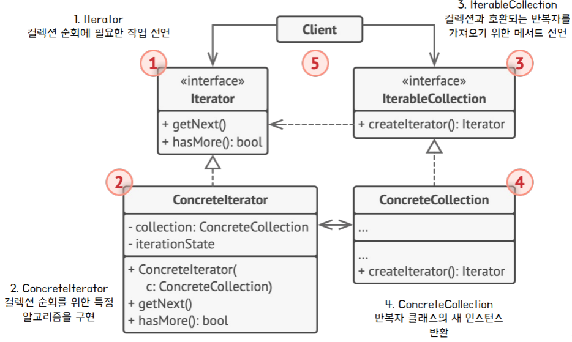

## COR Pattern 
### 책임 연쇄 패턴이란? 
- 클라이언트의 요청에 대한 세세한 처리를 한 객체가 전부하는 것이 아닌, 
여러 개의 객체들로 나누고 이를 사슬 (chain) 처럼 연결해 연쇄적으로 처리하는 행동 패턴 
- Handler(핸들러)
  - 처리 객체를 지칭
  - 요청을 받으면 각 핸들러는 요청을 처리할 수 있는지 판단, 없으면 다음 핸들러로 책임을 전가 

### 필요 상황 예시 
- 온라인 주문 시스템을 개발하려는 예시 
  - 인증된 사용자들만 주문을 생성할 수 있도록 시스템에 대한 접근을 제한 
  - 관리 권한이 있는 사용자들에게는 모든 주문에 대한 접근 권한을 부여 
  - 검사들은 차례대로 수행
### 책임 연쇄 패턴의 아이디어 
- 특정 행동들을 핸들러라는 독립 실행형 객체로 변환 
- 핸들러를 체인으로 연결하여 체인을 따라 요청을 처리
- 경우에 따라서는 핸들러가 요청을 체인 뒤로 더 이상 전달 하지 않고 추가 처리를 중지하는 결정을 할 수도 있다. 

### 구조 

- Handler interface
  - 공통적인 인터페이스를 선언 

- Base Handler (abstract class)
  - Handler 클래스들의 공통적인 상용구 코드를 넣을 수 있음 
  - e.g) 다음 핸들러 참조 

- Concrete Handler 
  - 요청을 처리하기 위한 실제 코드 포함 
- Client 
  - 체인들을 한 번만 구성하거나 동적으로 구성하여 Handler 호출 

### 사용시기   
- 특정 요청을 2개이상의 여러 객체에서 판별하고 처리해야 할 때 
- 특정 순서로 여러 핸들러를 실행해야 하는 경우 
- 프로그램이 다양한 방식과 종류의 요청을 처리할 것으로 예상되나, 요청 유형과 순서를 미리 알 수 없는 경우 
- 요청을 처리할 수 있는 객체 집합이 동적(런타임)으로 정의되어야 할 때 

### 장점 
- 클라이언트는 처리 객체의 ***체인 집합 내부의 구조***를 알 필요가 없음 
- 각각의 체인은 _**자신이 해야하는 일만 하기 때문에**_ 새로운 요청 처리에 유연하게 확장 가능 
- 클라이언트 _**코드를 변경하지 않고**_ 체인을 동적으로 변경 가능 

### 단점 
- 실행 시에 코드의 흐름이 많아져서 과정을 살펴보기가 복잡함 
- 사이클로 체인이 구성되면 무한 루프에 빠질 수 있음 
- 책임 연쇄로 인한 처리 지연 문제가 발생할 수 있음 

## Command Pattern 
### 명령 패턴이란? 
- 요청을 객체의 형태(Command)로 캡슐화하여 사용자가 보낸 요청을 나중에 이용할 수 있도록 재사용성을 높인 행동 
  - 요청을 보내는 쪽(invoker)과 요청을 받는 쪽(receiver)을 커맨드를 이용하여 디커플링하여 재사용성을 높이고자함 
  
### 필요 상황 예시 
- 텍스트 편집기 앱을 개발하고 있는 상황에서, 편집기의 다양한 작업을 위한 여러 버튼이 있는 도구 모음을 만든다고 할 때 
  - 도구 모음의 버튼과 다양한 대화 상자들의 일반 버튼들에 사용할 수 있는 Button 클래스를 생성 

#### 접근 
- 버튼의 모양은 비슷해 보이지만 각각 다른 기능을 수행해야함 
- 요청을 처리하기 위한 함수를 자식 클래스로 상속하고 오버라이딩하는 구조로 구성해야 한다면, 기능별로 상속을 다 해주어야한다. 

#### 문제점 
- Button 클래스를 수정할 때마다 자식 클래스가 영향을 받는다. 
- 동일한 기능을 하는 로직이 버튼이 아닌 다른 형태로 표현될 때 해당 기능을 Copy & Paster해야한다. 

#### 명령 패턴의 도입 (아이디어)
- 인터페이스 객체들이 요청을 직접 보내는 것이 아닌 _**Command을 경유하여 보낸다**_. 

### 개선 구조 

- 더 이상 다양한 클릭 행동들을 구현하기 위한 버튼의 여러 자식 클래스는 필요하지 않다. 
- 커맨드는 _**사용자 인터페이스와 비즈니스 로직 간의 결합도를 줄이는**_ 중간 레이어의 역할을 한다. 

### 구조 

### 장점 
- SRP 준수 
  - Invoker와 receiver로 책임을 분리한다. 
- OCP 
  - 기존 클라이언트 코드에 변경 없이 새로운 Command 도입 가능 
- 클라이언트와 receiver 간의 결합도 감소 
  - 클라이언트는 어떤 Command가 어떤 객체에서 어떻게 실행되는지 세부사항을 알 필요가 없다. 
- 명령 기록의 실행 취소/재실행 (undo/redo)
  - Invoker 내부에 Stack을 사용하여 Command history를 관리 가능 
  - e.g) Stack<Command> commandHistoryList;
  
### 단점 
- Invoker와 receiver 사이에 완전히 새로운 레이어(command)를 도입하기 때문에 코드가 더 복잡해질 수 있다. 
## Interpreter pattern 
### 해석자 패턴이란? 
- 언어(language)의 문법 규칙을 표현하고, 해당 언어를 해석하는데 사용되는 패턴
  - 컴파일러, 인터프리터를 개발할 때 적용되며 언어의 문법 구조를 나타내는데 유용하다. 
  - 문법 규칙을 _**클래스로 표현**_
    - 클래스를 조합하여 언어의 문장 해석 구조를 만듬 
  - 새로운 언어를 추가하거나 기존 언어의 문법을 변경할 때 유연하게 확장 가능 

### 필요 상황 예시
- Postfix Expression
  - 특정 연산자는 가장 마지막에 등장한 두 피연산자에 대해 계산
  - 가장 마지막으로 등장한 피연산자 (결과값)을 파악하기 위해 Stack을 활용

### 구조 

Context
- 모든 expression에서 사용하는 공통된 정보
- Postfix Expression에서는 HashMap형식으로 구현 
  - 변수 - 변수의 값 (x:1, y:2)

Expression 
- interpret 메서드 선언 
  - 해당 표현은 어떻게 해석하여 계산할 것인지 선언 
- Context를 인자로 받음 
  - 참조하여 인자의 값을 얻어옴 

- ConcreteExpression
  - interpret 메서드를 Expression의 종류에 따라 다르게 구현 
  - TerminalExpression
    - Expression 형식의 변수 하나를 저장  
    - 그 자체로 종료된다. 
    - 변수에 대한 값을 Context로 부터 가져와서 반환하면된다. 
    - e.g) X -> 1 
  - NonTerminalExpression
    - 다른 expression들을 재귀적으로 참조 
    - Expression형식의 변수 두개를 저장 
      - interpret 호출시, 변수의 interpret을 재귀적으로 호출 
      - +, -, *등에 따라 interpret은 다르게 구현 
      - Terminal Expression의 interpret이 호출되면 재귀 중지 
### 장점 
- 새로운 ***언어 요소나 문법 규칙을 추가***하기가 유연함 
- 단순한 문법을 가지는 언어의 경우 효과적 
- 언어의 문법이나 _**규칙이 변경되더라도 대응이 쉽다**_. 

### 단점 
- 언어의 문법이 복잡한 경우 인터프리터 패턴의 ***클래스 계층 구조가 복잡***해짐 
- 일부 복잡한 언어나 대규모 문장에 대해서는 패턴 적용 시 성능이 저하될 수 있음

## Iterator pattern 
### 반복자 패턴이란? 
- 컬렉션(Collection)요소들의 기본 표현(리스트,스택,트리)을 _**노출하지 않고**_, 컬렉션 내 _**요소를 하나씩 순회할 수 있도록**_ 하는 행동 패턴

### 필요한 상황 예시 
- Data Collection은 객체들을 그룹으로 묶어 자료구조에 맞게 저장 
- 자료구조의 종류에 따라 순회 방법이 달라짐 
  - 선형적인 자료구조(배열, 리스트)는 순차적으로 요소 조회 
  - 비선형적인 자료구조(트리, 해시)는 순회의 기준이 필요함 
- ***컬렉션의 종류를 따지지 않고 순회***할 수 있는 방법이 있을까? 

### 아이디어 
- 컬렉션의 순회 동작을 Iterator(반복자)라는 별도 객체로 추출 

### 구조 

- Iterator interface 
  - 컬렉션 순회에 필요한 작업 선언 
    - getNext 
      - 다음 원소 반환 
    - hasMore
      - 다음 원소가 존재하는지 
- ConcreteIterator 
  - 컬렉션 순회를 위한 특정 알고리즘을 구현 
    - Iterable interface에서 선언된 추상 메서드 구현 
  - ConcreteCollection의 createIterator 호출 시 Iterator 구현에 적절한 Collection 전달 
    - 이를 참조하여 추상 메서드 구현하면 된다. 
- IterableCollection
  - 컬렉션과 호환되는 반복자를 가져오기 위한 메서드 선언 
  - Iterator 변수를 반환  

- Concrete Collection 
  - IterableCollection을 구현 
  - createIterator
    - iterator을 생성 후 반환 
    - ConcreteIterator에 현재 Collection을 인자로 전달 
    
  

### 장점 
- 일관된 Iterator interface를 사용해 ***여러 종류의 컬렉션에 대해 동일한 순회 인터페이스***를 제공 
- 클라이언트는 컬렉션 _**내부 구조 및 순회 방식을 알지 않아도**_ 된다. 
- 컬렉션의 _**구현과 접근하는 부분을 반복자로 분리해**_ 결합도 감소 
### 단점 
- 만약 앱이 간단한 컬렉션에서만 작동하는 경우 패턴 적용시 코드가 복잡해짐 
- Iterator 객체를 만드는 것이 필요한 상황인지 판단할 필요가 있음 