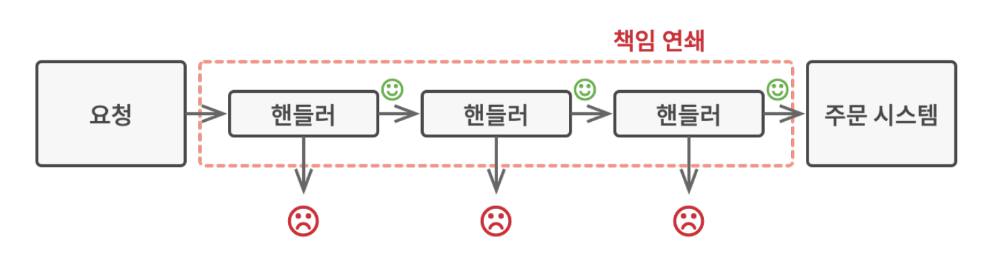
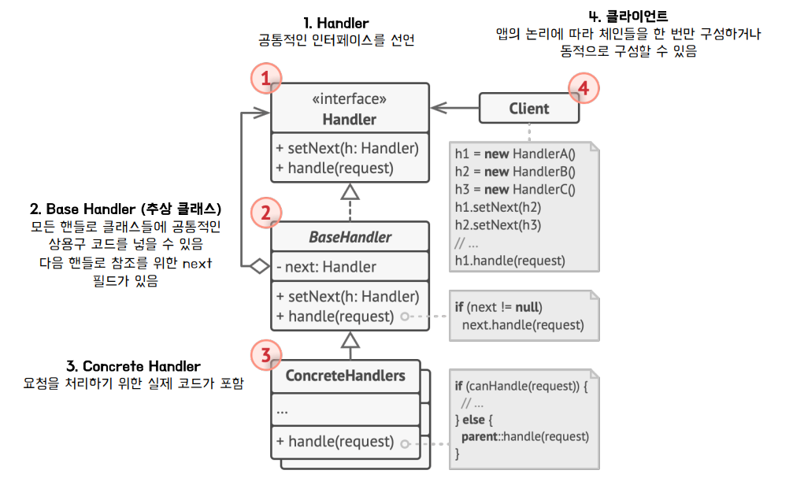

## COR Pattern 
### 책임 연쇄 패턴이란? 
- 클라이언트의 요청에 대한 세세한 처리를 한 객체가 전부하는 것이 아닌, 
여러 개의 객체들로 나누고 이를 사슬 (chain) 처럼 연결해 연쇄적으로 처리하는 행동 패턴 
- Handler(핸들러)
  - 처리 객체를 지칭
  - 요청을 받으면 각 핸들러는 요청을 처리할 수 있는지 판단, 없으면 다음 핸들러로 책임을 전가 

### 필요 상황 예시 
- 온라인 주문 시스템을 개발하려는 예시 
  - 인증된 사용자들만 주문을 생성할 수 있도록 시스템에 대한 접근을 제한 
  - 관리 권한이 있는 사용자들에게는 모든 주문에 대한 접근 권한을 부여 
  - 검사들은 차례대로 수행
### 책임 연쇄 패턴의 아이디어 
- 특정 행동들을 핸들러라는 독립 실행형 객체로 변환 
- 핸들러를 체인으로 연결하여 체인을 따라 요청을 처리
- 경우에 따라서는 핸들러가 요청을 체인 뒤로 더 이상 전달 하지 않고 추가 처리를 중지하는 결정을 할 수도 있다. 

### 구조 

- Handler interface
  - 공통적인 인터페이스를 선언 

- Base Handler (abstract class)
  - Handler 클래스들의 공통적인 상용구 코드를 넣을 수 있음 
  - e.g) 다음 핸들러 참조 

- Concrete Handler 
  - 요청을 처리하기 위한 실제 코드 포함 
- Client 
  - 체인들을 한 번만 구성하거나 동적으로 구성하여 Handler 호출 

### 사용시기   
- 특정 요청을 2개이상의 여러 객체에서 판별하고 처리해야 할 때 
- 특정 순서로 여러 핸들러를 실행해야 하는 경우 
- 프로그램이 다양한 방식과 종류의 요청을 처리할 것으로 예상되나, 요청 유형과 순서를 미리 알 수 없는 경우 
- 요청을 처리할 수 있는 객체 집합이 동적(런타임)으로 정의되어야 할 때 

### 장점 
- 클라이언트는 처리 객체의 ***체인 집합 내부의 구조***를 알 필요가 없음 
- 각각의 체인은 _**자신이 해야하는 일만 하기 때문에**_ 새로운 요청 처리에 유연하게 확장 가능 
- 클라이언트 _**코드를 변경하지 않고**_ 체인을 동적으로 변경 가능 

### 단점 
- 실행 시에 코드의 흐름이 많아져서 과정을 살펴보기가 복잡함 
- 사이클로 체인이 구성되면 무한 루프에 빠질 수 있음 
- 책임 연쇄로 인한 처리 지연 문제가 발생할 수 있음 

## Command Pattern 

## Interpreter pattern 

## Iterator pattern 

