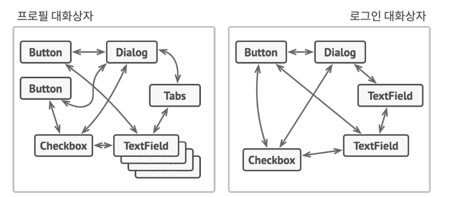
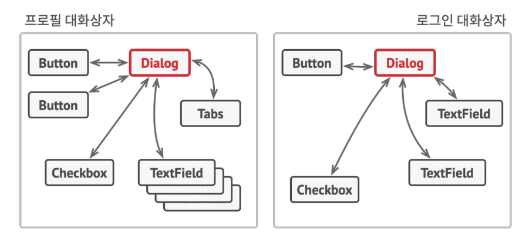
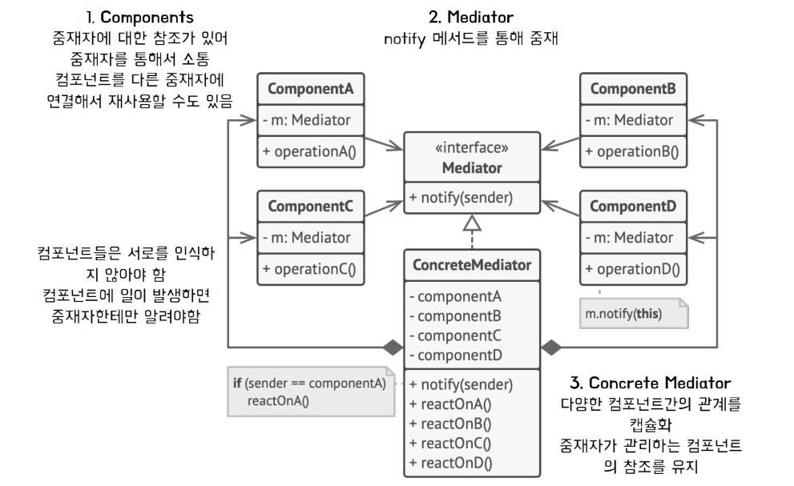
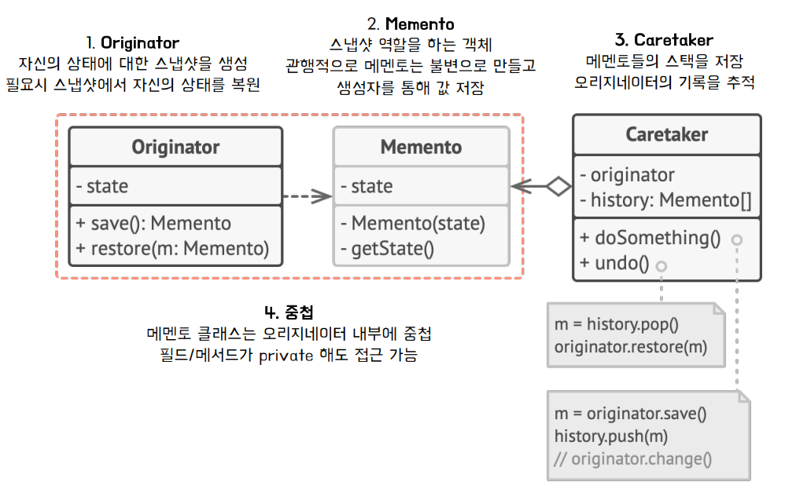
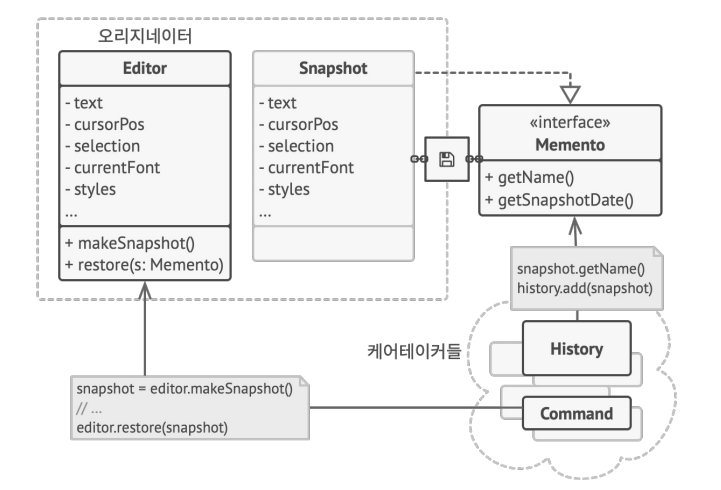

## Mediator Pattern
### 중재자 패턴이란? 
- 객체 간의 통신을 제한하고 중재자 객체를 통해서만 협력하도록 하는 행동 패턴 
  - 중재자 
    - 객체 간의 통신을 관리하고 매개체 역할을 함 
  - _**객체 간의 결합을 낮추고**_ 유연성을 확보 

### 필요 상황 예시 
- 프로필을 만들고 편집하기 위한 대화상자(dialog)에서 다양한 요소들이 상호 작용할 수 있음 
  - 각 객체들이 서로 필요한 객체들을 참조 
  - 한 클래스가 수정되면 ***연관된 클래스들의 수정***이 발생할 수 있다. 

### 도입 아이디어 

- 각 객체간의 연결을 느슨하게 만들어야 함
  - 객체간의 직접적인 통신을 중단 
  - 호출을 대신 처리할 수 있는 중재자 객체를 두어서 간접적인 협력을 수행 
  - M : N의 관계를 M : 1의 관계로 전환 

### 구조 

- Components 
  - Mediator을 주입받아 참조함 
  - 다른 Component와의 소통시, 참조하고 있는 Mediator 호출 
  - Component들간 직접적인 소통이 이루어지지 않음 
- Mediator Interface 
  - notify : 다른 Component과의 통신을 위한 메서드 규정 
- ConcreteMediator 
  - Mediator interface에서 규정한 notify메서드를 구현 

### 장점 
- 다양한 컴포넌트간의 _**통신을 한 곳으로 추출하여**_ 코드를 이해하고 유지관리하기 쉽게 만듬 
- 프로그램의 다양한 _**컴포넌트 간의 결합도를 줄일**_ 수 있음 
- 개별 컴포넌트들을 더 쉽게 재사용할 수 있음 
### 단점 
- 중재자는 god object로 발전할 수 있음 

### VS 퍼사드 패턴 
- Facade vs Mediator
  - 하위 시스템 자체는 퍼사드를 인식하지 못함 vs Component에서 Mediator을 인식 가능하고 이를 통해 통신 
  - 시스템 내의 객체들은 직접 통신 가능함 vs Component들끼리는 통신이 불가능함 

- Mediator only 
  - 중재자는 시스템 컴포넌트 간의 통신을 중앙 집중화 함 
- Facade only 
  -   - 객체들의 하위 시스템에 대한 단순화된 인터페이스를 도입하지만, 새로운 기능을 도입하지 않음
## Memento Pattern
### 메멘토 패턴이란? 
- 객체의 구현 세부 상항을 공개하지 않으면서 해당 객체의 이전 상태 값을 저장(스냅샷)하고 복원할 수 있게 해주는 행동 패턴 

### 필요 상황 예시 
- 텍스트 편집기에서 실행 취소를 구현하려고 할 때 
  - 특정 작업을 수행하기 전에 ***모든 객체의 상태(스냅샷)***를 기록 
  - 실행 취소하면 기록에서 _**가장 최신 스냅샷을 가져와**_ 복원 

- 객체의 모든 필드를 살펴본 후에 해당 값을 복사해야 한다. 
  - 대부분의 실제 객체들은 모든 중요한 데이터를 비공개 (캡슐화) 
  - 공개된 필드이더라도, 객체 일부가 수정되면 복사를 맡은 클래스들은 역시 변경이 되어야함 

### 아이디어 
- 스냅샷 생성 
  - 해당 상태의 실제 소유자인 originator에게 위임
- 스냅샷 저장 
  - Memento라는 특수 객체에 스냅샷 저장 
  - Memento를 생성한 객체를 제외한 다른 어떤 객체도 접근 불가능함 
### 구조 

- Originator
  - 스냅샷 생성, 복원 
  - Memento를 inner class로 가지고 있어서 접근 가능 
- Memento 
  - Snapshot 
  - 불변으로 만들고 생성자를 통해 값을 저장 
    - outer class인 Originator에서 받은 인자를 전달, new 연산자를 통해 생성 
- Caretaker 
  - Memento들의 history를 해당 클래스 내에 저장 
    - Originator에서는 스냅샷 생성, 복원만 담당 
  - 스냅샷 저장, 복원시 
    - 값이 저장된 ***editor 객체를 인자***로 받음 
    - 지역변수인 history stack과 editor를 통해서 snapshot저장과 복원을 자유롭게 할 수 있음 

#### 구조 예시 

### 장점 
- 캡슐화를 위반하지 않고 객체의 상태 스냅샷 생성 가능 
- CareTaker가 Originator의 상태기록(Snapshot history Stack)을 유지
  - Originator의 코드를 단순화 시킬 수 있음 

### 단점
- 클라이언트들이 메멘토를 너무 자주 생성하면 메모리 사용이 늘어남 
- CareTaker에 오래된 Memento를 삭제하고 관리하는 역할이 부여

## Observer Pattern

## State Pattern

## Strategy Pattern

## Template Pattern 