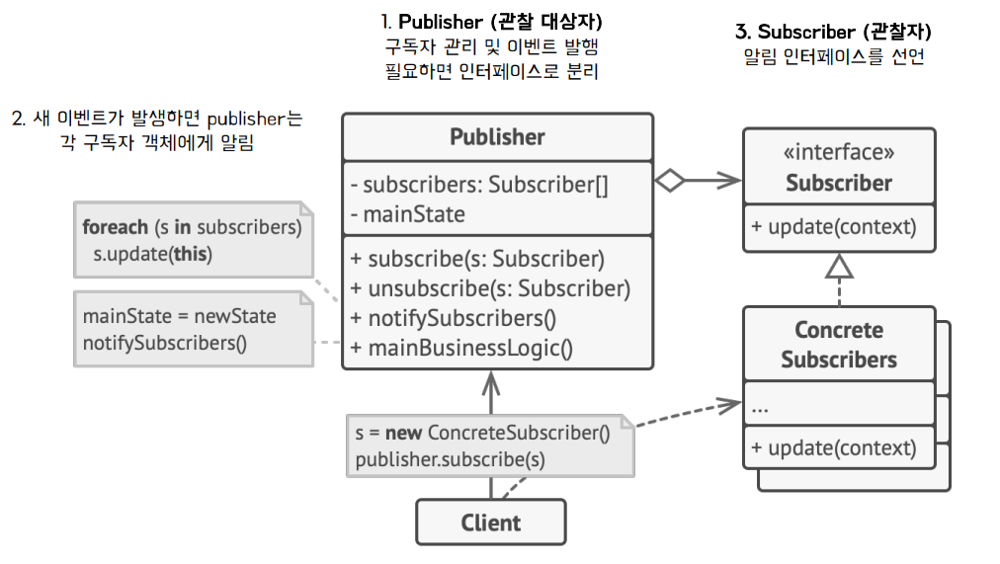
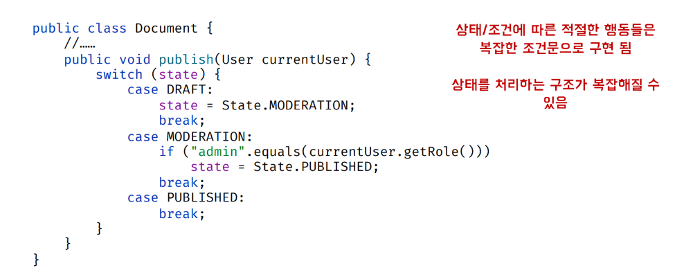
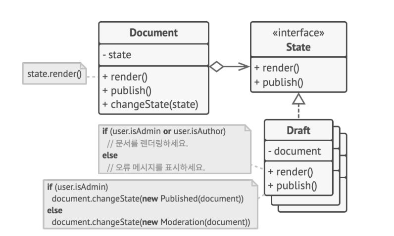
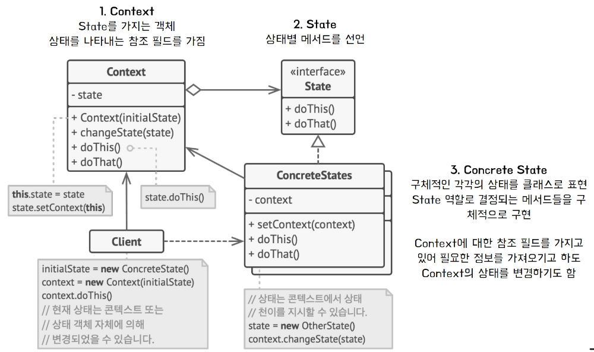
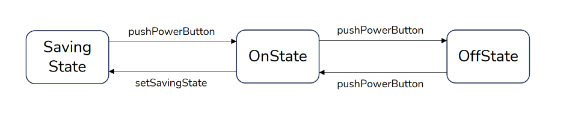
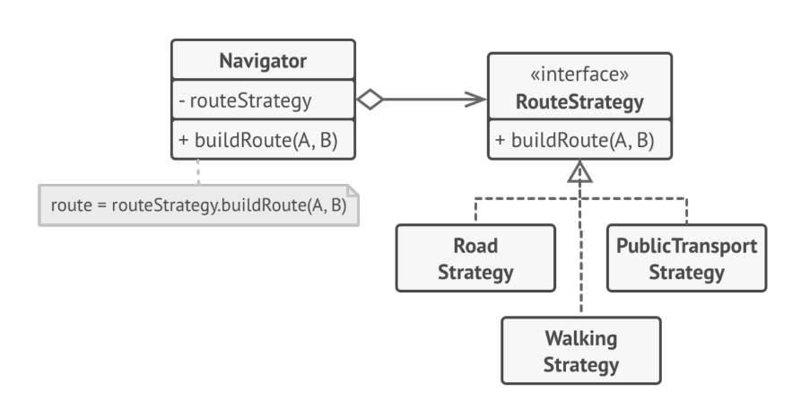
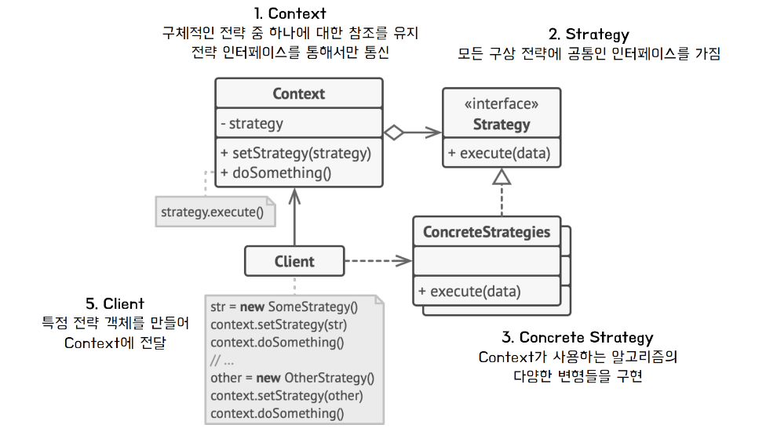
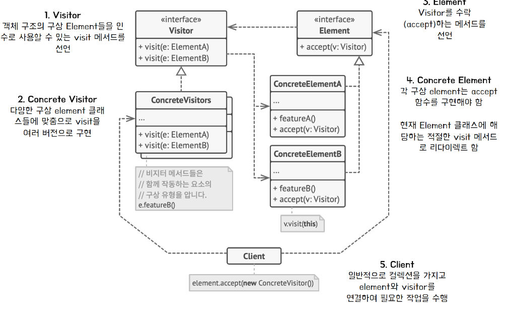

## Mediator Pattern
### 중재자 패턴이란? 
- 객체 간의 통신을 제한하고 중재자 객체를 통해서만 협력하도록 하는 행동 패턴 
  - 중재자 
    - 객체 간의 통신을 관리하고 매개체 역할을 함 
  - _**객체 간의 결합을 낮추고**_ 유연성을 확보 

### 필요 상황 예시 
- 프로필을 만들고 편집하기 위한 대화상자(dialog)에서 다양한 요소들이 상호 작용할 수 있음 
  - 각 객체들이 서로 필요한 객체들을 참조 
  - 한 클래스가 수정되면 ***연관된 클래스들의 수정***이 발생할 수 있다. 

### 도입 아이디어 

- 각 객체간의 연결을 느슨하게 만들어야 함
  - 객체간의 직접적인 통신을 중단 
  - 호출을 대신 처리할 수 있는 중재자 객체를 두어서 간접적인 협력을 수행 
  - M : N의 관계를 M : 1의 관계로 전환 

### 구조 

- Components 
  - Mediator을 주입받아 참조함 
  - 다른 Component와의 소통시, 참조하고 있는 Mediator 호출 
  - Component들간 직접적인 소통이 이루어지지 않음 
- Mediator Interface 
  - notify : 다른 Component과의 통신을 위한 메서드 규정 
- ConcreteMediator 
  - Mediator interface에서 규정한 notify메서드를 구현 

### 장점 
- 다양한 컴포넌트간의 _**통신을 한 곳으로 추출하여**_ 코드를 이해하고 유지관리하기 쉽게 만듬 
- 프로그램의 다양한 _**컴포넌트 간의 결합도를 줄일**_ 수 있음 
- 개별 컴포넌트들을 더 쉽게 재사용할 수 있음 
### 단점 
- 중재자는 god object로 발전할 수 있음 

### VS 퍼사드 패턴 
- Facade vs Mediator
  - 하위 시스템 자체는 퍼사드를 인식하지 못함 vs Component에서 Mediator을 인식 가능하고 이를 통해 통신 
  - 시스템 내의 객체들은 직접 통신 가능함 vs Component들끼리는 통신이 불가능함 

- Mediator only 
  - 중재자는 시스템 컴포넌트 간의 통신을 중앙 집중화 함 
- Facade only 
  -   - 객체들의 하위 시스템에 대한 단순화된 인터페이스를 도입하지만, 새로운 기능을 도입하지 않음
## Memento Pattern
### 메멘토 패턴이란? 
- 객체의 구현 세부 상항을 공개하지 않으면서 해당 객체의 이전 상태 값을 저장(스냅샷)하고 복원할 수 있게 해주는 행동 패턴 

### 필요 상황 예시 
- 텍스트 편집기에서 실행 취소를 구현하려고 할 때 
  - 특정 작업을 수행하기 전에 ***모든 객체의 상태(스냅샷)***를 기록 
  - 실행 취소하면 기록에서 _**가장 최신 스냅샷을 가져와**_ 복원 

- 객체의 모든 필드를 살펴본 후에 해당 값을 복사해야 한다. 
  - 대부분의 실제 객체들은 모든 중요한 데이터를 비공개 (캡슐화) 
  - 공개된 필드이더라도, 객체 일부가 수정되면 복사를 맡은 클래스들은 역시 변경이 되어야함 

### 아이디어 
- 스냅샷 생성 
  - 해당 상태의 실제 소유자인 originator에게 위임
- 스냅샷 저장 
  - Memento라는 특수 객체에 스냅샷 저장 
  - Memento를 생성한 객체를 제외한 다른 어떤 객체도 접근 불가능함 
### 구조 

- Originator
  - 스냅샷 생성, 복원 
  - Memento를 inner class로 가지고 있어서 접근 가능 
- Memento 
  - Snapshot 
  - 불변으로 만들고 생성자를 통해 값을 저장 
    - outer class인 Originator에서 받은 인자를 전달, new 연산자를 통해 생성 
- Caretaker 
  - Memento들의 history를 해당 클래스 내에 저장 
    - Originator에서는 스냅샷 생성, 복원만 담당 
  - 스냅샷 저장, 복원시 
    - 값이 저장된 ***editor 객체를 인자***로 받음 
    - 지역변수인 history stack과 editor를 통해서 snapshot저장과 복원을 자유롭게 할 수 있음 

#### 구조 예시 

### 장점 
- 캡슐화를 위반하지 않고 객체의 상태 스냅샷 생성 가능 
- CareTaker가 Originator의 상태기록(Snapshot history Stack)을 유지
  - Originator의 코드를 단순화 시킬 수 있음 

### 단점
- 클라이언트들이 메멘토를 너무 자주 생성하면 메모리 사용이 늘어남 
- CareTaker에 오래된 Memento를 삭제하고 관리하는 역할이 부여

## Observer Pattern
### 옵서버 패턴이란? 
- 옵서버들이 관찰하고 있는 대상의 상태 변화가 있을 때마다 
  - 대상자는 각 관찰자에게 통지 
  - 관찰자들은 알림을 받아 조치를 취함 
- 발행 구독 모델 

### 구조 

- Publisher 
  - 관찰 대상자 
  - 구독자 관리 
    - 구독자 추가 (subscribe)
    - 구독자 삭제 (unsubscribe)
  - 이벤트 발생
    - Publisher내의 값들 변화 시, 본인이 등록한 Subscriber에게 상태변화 전달
    - Publisher 인스턴스 그 자체(this)를 Subscriber에게 인자로 전달하여 상태 변화 알림 가능 

- Subscriber Interface
  - 관찰자 인터페이스 
  - 알림 인터페이스 선언 

- Concrete Subscriber 
  - 알림 인터페이스 구현 
    - Publisher의 상태 변화 알림 전달받아 나타낼(display) 함수

### 흐름 
- 한 개의 관찰 대상자(Publisher)와 여러 개의 관찰자(Subscriber)
  - 1 : N
- 관찰 대상자의 상태가 바뀌면, 변경사항을 관찰자에게 통보 
- 통보를 받은 관찰자는 적절하게 필요에 맞추어 업데이트 
- 언제든지 구독 추가/취소 가능 

### 장점 
- 관찰자(Publisher) 입장에서 관찰 대상자(Subscriber)의 상태 변경을 주기적으로 조회하지 않고 자동으로 감지 
- 관찰자의 코드를 변경하지 않고 새 구독자 클래스를 도입 
- 런 타임 시점에 발행자와 구독 알림 관계를 맞는다. 
- 상태 변경하는 객체(관찰 대상자)와 변경을 감지하는 객체(관찰자)의 관계를 느슨하게 유지  
### 단점 
- 구독자(관찰자)는 알림 순서를 제어할 수 없고, 무작위로 통보만 받음 
- 다수의 관찰자 객체 등록 이후, 사용하지 않는 관찰자를 해지하지 않는다면 메모리 낭비 발생 

## State Pattern
### 상태 패턴이란? 
- 객체의 내부 상태가 변경될 때, 객체 스스로가 상태에 따라 행동을 변경할 수 있도록하는 행동 패턴 
- e.g) 
  - TV 전원의 상태에 따라 메소드의 행동이 바뀜 
    - OnState라면 음량 버튼은 음량을 조절할 수 있다. 
    - Offstate라면 음량 조절이 불가능함 
### 필요 상황 예시 
- Document(문서)클래스는 다음과 같은 상태를 가짐 
  - Draft(초안), Moderation(검토), Published(출판)
- Publish 메서드는 _**각 상태에 따라 약간씩 다르게 작동**_ 
  - Draft : 문서를 검토 상태로 이동 
  - Moderation : 문서를 공개하거나 관리자에게만 공개 
  - Published : 아무런 작업을 하지 않음

### 아이디어 
- 객체의 모든 가능한 상태들에 대해서 새 클래스를 만들고 모든 상태별 행동들을 상태 클래스에서 추출(구현)

### 구조 

- State Interface
  - 상태별 메서드 선언
- Concrete States
  - 구체적인 각각의 상태를 클래스로 표현 
  - State Interface를 구현 
  - State Interface에서 선언한 메서드를 구현
    - 각각의 State에 따라 구현 내용이 달라짐 
- Context
  - State를 주입 받아 변수로 가짐 
  - Context의 특정 동작 호출시, 가지고 있는 State 변수에 따라 처리가 달라진다. 
    - State 변수를 통해 동작 호출 
    - 자신의 Context 객체(this)을 인자로 전달 

### 구현 코드 설명  

### 장점 
- SRP 
  - 상태에 따른 동작을 개별 클래스(State를 구현한 구체클래스)로 옮겨서 관리 가능 
- OCP 
  - 기존 상태 클래스나 컨텍스트를 변경하지 않고 새 상태 도입 가능 

### 단점 
- 상태 별로 클래스를 생성해야하므로 _**관리해야하는 클래스 수가 증가**_ 
- 객체에 적용할 상태가 몇 가지 밖에 없거나 거의 상태 변경이 이루어지지 않는 경우 패턴 적용이 과할 수 있음 
## Strategy Pattern
### 전략 패턴이란? 
- ***실행 중에 알고리즘 전략을 선택***하여 객체 동작을 실시간으로 바뀌도록 할 수 있게 하는 행동 패턴 

### 필요 상황 예시 
- 내비게이션 앱에서 목적지까지 빠른 경로를 찾아주는 기능을 설계한다고 하자 
  - 도로로 된 경로만을 찾을 수 있도록 할 때 
    - 자동차 사용자는 만족하지만, 차가 없는 사람은 만족스럽지 않음 
  - 도보, 대중교통, 자전거 등의 경로 옵션을 제공하는 형태로 확장 
  - 새로운 경로 구축 알고리즘을 추가할 때마다 네비게이터 클래스가 복잡해짐
### 아이디어 
- 특정 작업은 다양한 방식으로 수행하는 클래스를 선택한 후 모든 알고리즘은 Strategy라는 별도의 클래스로 추출 

### 구조 

- Context
  - 구체적인 Strategy 하나에 대한 참조를 유지
  - Context내에서의 직접 수행이 아닌, 참조를 하고 있는 전략 내의 메서드를 호출 
- Strategy Interface
  - 모든 Strategy에 공통인 인터페이스를 가진다. 
- Concrete Strategy 
  - Strategy Interface에서 선언한 메서드를 다양한 전략으로 메서드 구현 
- Client 
  - 특정 Strategy 객체를 만듦 
  - Context에 해당 Strategy 전달 
  - Context의 전략을 동적으로 변경 가능함 (setter 호출) 

### 장점 
- 런타임에 객체 내부에서 사용되는 알고리즘(=Strategy)을 교환 가능하다. 
- OCP 준수 
  - 새로운 알고리즘을 추가하더라도 기존 코드에 영향이 없다. 
- SRP 
  - Interface Strategy를 구현한 클래스는 단 하나의 알고리즘을 가진다. 
- 다른 컨텍스트에서 Strategy를 재사용하기 편함 

### 단점 
- 알고리즘이 몇 개밖에 되지 않고 거의 변하지 않는다면 과한 구현 방법일 수 있다. 
- 클라이언트들은 적절한 전략을 선택할 수 있도록 전략간의 차이점을 알고 있어야 함 

### State VS Strategy 
#### 공통점 
- 클래스 다이어그램이 거의 유사하고 사용법이 비슷하다. 
- 합성(Composite)을 통해 해결 

#### 차이점 
- 초점 
  - State : 상태에 따른 행동 변화 
  - Strategy : 알고리즘의 동적인 교체에 집중 

- 적용 시나리오 
  - State 
    - 객체가 여러 상태를 가지고 있다. 
    - 상태에 따른 행동이 다른 경우 
  - Strategy 
    - 알고리즘이 독립적으로 정의하고 교체해야핳 때 
## Template Pattern
## Visitor Pattern 
### 방문자 패턴이란? 
- 알고리즘을 객체 구조에서 분리시키려는 행위 패턴 
  - 각 클래스들의 데이터 구조에서 처리기능을 분리하여 별도의 클래스로 구현하는 패턴
  - 분리된 처리 기능은 방문자(visitor)을 통해 각 클래스를 방문하면서 수행 

### 필요 상황 예시 
- 그래프로 구성된 지리 정보를 사용해 작동하는 앱을 구현 중이라 가정 
- 그래프를 XML 형식으로 내보내는 작업을 구현하려고 할 때, 기존 노드 클래스 변경 불가라면?
  - 각 노드 클래스에 export 메서드를 추가해서 그래프 순회하며 export 수행 
    - XML export 메서드를 모든 노드 클래스에 추가해야한다. 
      - 이러한 변경으로 인해 전체 앱이 망가질 수 있다. 
      - 노드의 클래스의 주 작업은 지리 데이터를 처리 하는 것이기 때문에 export를 추가하는 것이 적절하지 않을 수 있다. 
- 만약 다른 형식으로 확장해야 한다면, 클래스 전반적으로 다시 수정해야 함 

### 아이디어 
- 데이터 처리하는 기능을 기존 클래스에 두지 않고, 방문자라는 별도의 클래스에 배치 
  - 방문자에 의해 방문되면서 처리 기능 수행 
  - ***방문자의 인자로 원래 객체***를 전달하여 구현 
    - Concrete Visitor에는 인자로 받은 원래 객체의 형태에 따라 구현되는 메서드가 오버로딩 되어 있음
    - 원래 객체의 정보에 접근 가능함 
  

### 구조 

- Visitor Interface 
  - Concrete Element을 인수로 사용할 수 있는 visit 메서드를 선언 
- Concrete Visitor 
  - Concrete Element 클래스의 종류에 따라 visit 메서드를 구현 (오버로딩)
- Element 
  - Visitor을 accept하는 메서드를 선언 
- Concrete Element 
  - accept 메서드 구현 
    - 메서드로 받은 Visitor의 visit 메서드 호출
    - 수행해야할 기능의 목록이 Visitor클래스를 구현한 클래스 내에 들어가 있다. 

### 장점 
- OCP 준수 
  - 다른 클래스(ConcreteElements)를 변경하지 않으면서 해당 클래스의 객체와 작동할 수 있는 새로운 행동을 도입 
- SRP 
  - 동작을 클래스로 캡슐화 
  - 자신의 추된 책임에 집중 

- Visitor 클래스는 관련된 동작을 캡슐화하므로 동일한 동작을 다양한 element 클래스에 재사용할 수 있다. 

### 단점 
- ConcreteElements가 추가될 때 Visitor에 대한 수정이 발생 
  - Visitor에 새로운 메소드 오버로딩 된 상태로 추가 필요 
- 런타임에 동작을 결정하기 때문에 실행 시 오버헤드가 발생 